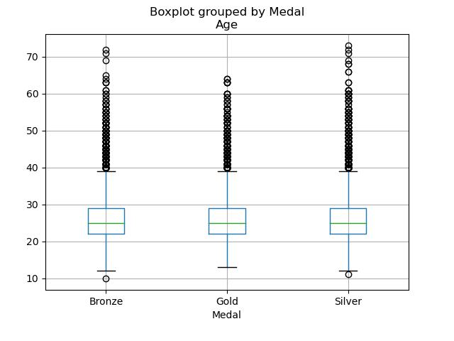
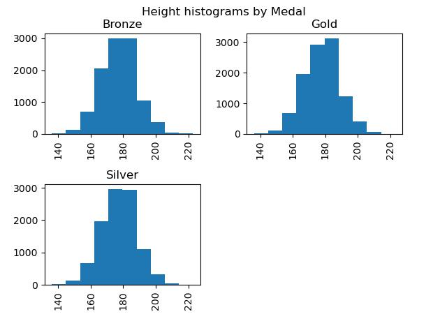
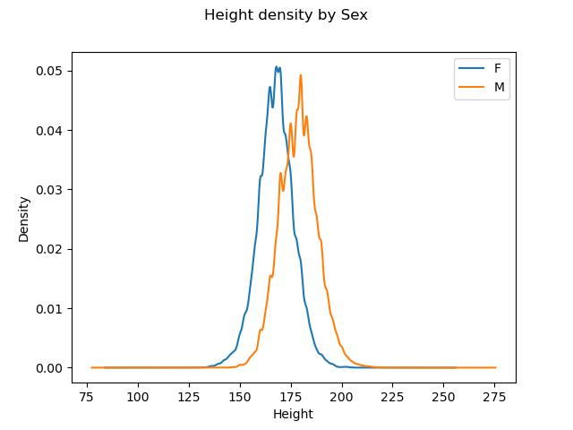

# Bootcamp datascience

This bootcamp is an introduction to **datascience** with python, conda, numpy, panda and matplotlib.

A walk through python language, matrix manipulations, image filters, implementation of **k-mean clustering algorithm**, feature engineering and ploting data with panda.

## Plots based from a file grouping data about olympics athletes

